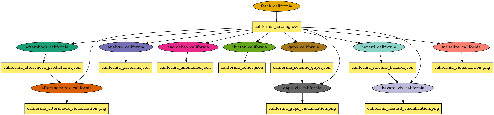

# Earthquake/Seismic Data Workflow

A Pegasus-based workflow for analyzing earthquake data from the USGS Earthquake API, demonstrating AI-assisted scientific workflow development with ML-based predictions.

## Overview

This workflow fetches, analyzes, and visualizes earthquake data from the USGS FDSNWS Event web service, providing insights into seismic patterns, aftershock sequences, spatial-temporal clustering, seismic hazard assessment, and seismic gap detection.

**API**: https://earthquake.usgs.gov/fdsnws/event/1/

## Features

### Data Acquisition & Basic Analysis

- **Data Fetching**: Fetch real-time and historical earthquake data from USGS API
  - Global coverage with predefined regions (Pacific Ring of Fire, California, Japan, etc.)
  - Custom bounding boxes and magnitude filtering
  - Rich metadata (depth, magnitude type, tsunami flags, station data)

- **Seismic Pattern Analysis**: Analyze magnitude distributions, depth profiles, temporal trends
  - Gutenberg-Richter b-value estimation
  - Magnitude-frequency distributions
  - Temporal clustering analysis

- **Seismic Zone Clustering**: Identify seismic zones using multiple algorithms
  - DBSCAN (density-based, auto-determines clusters)
  - K-Means (centroid-based clustering)
  - Hierarchical (agglomerative clustering)
  - Zone characterization (magnitude stats, depth profiles, event density)

- **Anomaly Detection**: Detect unusual seismic activity patterns
  - Earthquake swarms detection
  - Mainshock-aftershock sequence identification
  - Magnitude anomalies (z-score based)
  - Seismic rate changes
  - Depth anomalies

### ML-Based Predictions

- **Aftershock Prediction**: Statistical and ML-based aftershock probability prediction
  - Omori-Utsu law for temporal decay modeling
  - Bath's Law for largest aftershock estimation
  - Random Forest / Gradient Boosting classifiers
  - 17 seismic features including b-value, moment rate, historical patterns
  - Training and inference modes

- **Seismic Hazard Assessment**: Probabilistic seismic hazard analysis (PSHA)
  - Ground Motion Prediction Equations (GMPEs): NGA-West2, Boore-Atkinson
  - Grid-based hazard mapping
  - PGA exceedance probability calculations
  - Hazard curves for multiple return periods (50, 100, 475 years)
  - Risk level classification (very_low → very_high)

- **Seismic Gap Analysis**: Identify regions with anomalous quiescence
  - Temporal rate comparison (historical vs recent periods)
  - Poisson significance testing for rate decreases
  - Moment deficit estimation
  - Potential magnitude calculation
  - Composite risk scoring

### Visualization

- **Earthquake Visualization**: Geographic maps, time series, magnitude-depth plots
- **Aftershock Visualization**: Mainshock maps, probability charts, Omori decay curves
- **Hazard Visualization**: PGA maps, risk distribution, hazard curves, exceedance summaries
- **Gap Visualization**: Gap maps, rate ratio heatmaps, potential magnitude charts

### Workflow Orchestration

- **Pegasus Workflow**: Complete workflow orchestration
  - Singularity container support
  - HTCondor integration
  - Parallel job execution
  - 11-step analysis pipeline

## Prerequisites: Pegasus/HTCondor Cluster

Before running this workflow, you need a Pegasus/HTCondor cluster. This cluster can be deployed on any infrastructure that supports HTCondor and Pegasus WMS, including cloud providers (AWS, GCP, Azure), on-premises clusters, or research testbeds.

Below we provide an example of how to deploy the cluster on the [FABRIC testbed](https://fabric-testbed.net/):

### Option 1: FABRIC Artifact (Recommended)

Download and run the pre-configured Pegasus-FABRIC notebook from the FABRIC Artifacts repository:

**Artifact URL**: https://artifacts.fabric-testbed.net/artifacts/53da4088-a175-4f0c-9e25-a4a371032a39

This artifact contains a complete setup for deploying a distributed Pegasus/HTCondor infrastructure across FABRIC sites.

### Option 2: Jupyter Examples Repository

Use the Pegasus-FABRIC notebook from the official FABRIC Jupyter examples:

**GitHub**: https://github.com/fabric-testbed/jupyter-examples/blob/f7be0c75f22544c72d7b3e3fa42bbdfd9d8bb841/fabric_examples/complex_recipes/pegasus/pegasus-fabric.ipynb

### Cluster Architecture

The notebook provisions:
- **Submit Node**: Central Manager running HTCondor scheduler and Pegasus WMS
- **Worker Nodes**: Distributed execution points across multiple FABRIC sites
- **FABNetv4 Networking**: Private L3 network connecting all nodes

### Setup Steps

1. Log into the [FABRIC JupyterHub](https://jupyter.fabric-testbed.net/)
2. Upload/clone the Pegasus-FABRIC notebook
3. Configure your desired sites and node specifications
4. Run the notebook to provision the cluster
5. SSH to the submit node to run workflows

Once your cluster is running, you can submit this workflow to it.

## Quick Start

### 1. Generate and Run Workflow

```bash
cd earthquake-workflow

# Generate workflow for California earthquakes
./workflow_generator.py \
    --regions california \
    --start-date 1994-01-01 \
    --end-date 1994-01-31 \
    --min-magnitude 3.0 \
    -o workflow_california.yml

# Submit to Pegasus/HTCondor
pegasus-plan --submit -s condorpool -o local workflow_california.yml

# Monitor status
pegasus-status <submit_dir>
```

### 2. Run Individual Scripts

```bash
# Fetch earthquake data
./bin/fetch_earthquake_data.py \
    --start-date 1994-01-01 \
    --end-date 1994-01-31 \
    --region california \
    --min-magnitude 3.0 \
    --output california_catalog.csv

# Analyze seismic patterns
./bin/analyze_seismic_patterns.py \
    --input california_catalog.csv \
    --output california_patterns.json

# Visualize earthquakes
./bin/visualize_earthquakes.py \
    --input california_catalog.csv \
    --output california_visualization.png \
    --title California_Earthquakes

# Detect anomalies
./bin/detect_seismic_anomalies.py \
    --input california_catalog.csv \
    --output california_anomalies.json

# Cluster seismic zones (DBSCAN)
./bin/cluster_seismic_zones.py \
    --input california_catalog.csv \
    --output california_zones.json \
    --method dbscan \
    --eps 50 \
    --min-samples 10

# Predict aftershocks
./bin/predict_aftershocks.py \
    --input california_catalog.csv \
    --output california_aftershock_predictions.json \
    --mainshock-threshold 5.0

# Visualize aftershock predictions
./bin/visualize_aftershock_predictions.py \
    --input california_aftershock_predictions.json \
    --catalog california_catalog.csv \
    --output california_aftershock_viz.png

# Assess seismic hazard
./bin/assess_seismic_hazard.py \
    --input california_catalog.csv \
    --output california_hazard.json \
    --grid-resolution 0.5

# Visualize seismic hazard
./bin/visualize_seismic_hazard.py \
    --input california_hazard.json \
    --catalog california_catalog.csv \
    --output california_hazard_viz.png

# Analyze seismic gaps
./bin/analyze_seismic_gaps.py \
    --input california_catalog.csv \
    --output california_gaps.json \
    --historical-years 20 \
    --recent-years 5

# Visualize seismic gaps
./bin/visualize_seismic_gaps.py \
    --input california_gaps.json \
    --catalog california_catalog.csv \
    --output california_gaps_viz.png
```

## Workflow Architecture

```
                         ┌─────────────────────────┐
                         │  fetch_earthquake_data  │
                         │    (USGS API fetch)     │
                         └───────────┬─────────────┘
                                     │
         ┌───────────────────────────┼───────────────────────────┐
         │                           │                           │
         ▼                           ▼                           ▼
┌─────────────────┐       ┌─────────────────┐       ┌─────────────────────┐
│analyze_seismic_ │       │   visualize_    │       │detect_seismic_      │
│    patterns     │       │  earthquakes    │       │    anomalies        │
│ (stats, b-value)│       │ (maps, plots)   │       │(swarms, sequences)  │
└─────────────────┘       └─────────────────┘       └─────────────────────┘
         │                           │                           │
         │    ┌──────────────────────┼──────────────────────┐    │
         │    │                      │                      │    │
         │    ▼                      ▼                      ▼    │
         │  ┌─────────────┐  ┌───────────────┐  ┌───────────────┐│
         │  │cluster_     │  │predict_       │  │assess_seismic_││
         │  │seismic_zones│  │aftershocks    │  │hazard         ││
         │  │(DBSCAN/etc) │  │(Omori/ML)     │  │(GMPE/PSHA)    ││
         │  └──────┬──────┘  └───────┬───────┘  └───────┬───────┘│
         │         │                 │                  │        │
         │         │                 ▼                  ▼        │
         │         │       ┌─────────────────┐  ┌───────────────┐│
         │         │       │visualize_      │  │visualize_     ││
         │         │       │aftershock_pred │  │seismic_hazard ││
         │         │       └─────────────────┘  └───────────────┘│
         │         │                                             │
         │         │         ┌───────────────┐                   │
         │         │         │analyze_       │◄──────────────────┘
         │         │         │seismic_gaps   │
         │         │         │(quiescence)   │
         │         │         └───────┬───────┘
         │         │                 │
         │         │                 ▼
         │         │         ┌───────────────┐
         │         │         │visualize_     │
         │         │         │seismic_gaps   │
         │         │         └───────────────┘
         │         │                 │
         └─────────┴─────────────────┴─────────────────────────────┐
                                                                   │
                                     ▼                             │
                              Output Files                         │
                         (11 files per region)◄────────────────────┘
```

### DAG Visualization

The following diagram shows the workflow DAG for a single region:



## Workflow Generator Options

```bash
./workflow_generator.py --help

Required Arguments:
  --regions REGION [REGION ...]   Region names to analyze
  --start-date YYYY-MM-DD         Start date for data fetch

Optional Arguments:
  -o, --output FILE               Output workflow file (default: workflow.yml)
  -e, --execution-site-name STR   Execution site (default: condorpool)
  -s, --skip-sites-catalog        Skip site catalog creation
  --end-date YYYY-MM-DD           End date (default: start + 30 days)
  --min-magnitude FLOAT           Minimum magnitude (default: 4.0)

Clustering Options:
  --cluster-method METHOD         dbscan, kmeans, or hierarchical (default: dbscan)
  --cluster-eps FLOAT             DBSCAN: Max distance in km (default: 50)
  --cluster-min-samples INT       DBSCAN: Min samples for core points (default: 10)
  --cluster-n-clusters INT        K-Means/Hierarchical: Number of clusters (default: 5)

Aftershock Prediction Options:
  --aftershock-threshold FLOAT    Min magnitude for mainshock (default: 5.0)
  --aftershock-time-windows INT+  Time windows in days (default: 1 7 30)

Seismic Hazard Options:
  --hazard-grid-resolution FLOAT  Grid resolution in degrees (default: 1.0)
  --hazard-pga-thresholds FLOAT+  PGA thresholds in g (default: 0.1 0.2 0.4)

Seismic Gap Options:
  --gap-historical-years INT      Historical period in years (default: 20)
  --gap-recent-years INT          Recent period in years (default: 5)
  --gap-rate-threshold FLOAT      Rate ratio threshold for gaps (default: 0.3)
```

### Workflow Examples

```bash
# Single region with default settings
./workflow_generator.py --regions california --start-date 2024-01-01

# Multiple regions
./workflow_generator.py --regions california japan indonesia \
    --start-date 2024-01-01 --end-date 2024-06-30

# Custom clustering with K-Means
./workflow_generator.py --regions california \
    --start-date 2024-01-01 \
    --cluster-method kmeans \
    --cluster-n-clusters 8

# Custom aftershock and hazard settings
./workflow_generator.py --regions japan \
    --start-date 2024-01-01 \
    --aftershock-threshold 4.5 \
    --hazard-grid-resolution 0.5 \
    --gap-historical-years 30

# Higher magnitude threshold for global analysis
./workflow_generator.py --regions pacific_ring \
    --start-date 2024-01-01 \
    --min-magnitude 5.0
```

## Predefined Regions

| Region | Coverage | Use Case |
|--------|----------|----------|
| `pacific_ring` | Pacific Ring of Fire | High seismic activity zone |
| `california` | California, USA | San Andreas Fault, high earthquake frequency |
| `japan` | Japanese archipelago | Subduction zone, frequent earthquakes |
| `indonesia` | Indonesian archipelago | Ring of Fire, high tsunami risk |
| `turkey` | Turkey and surroundings | Recent major earthquakes (2023) |
| `chile` | Chile | Subduction zone, mega-earthquakes |
| `worldwide` | Global | No bounding box |

## Output Files

For each region, the workflow produces:

| File | Description |
|------|-------------|
| `{region}_catalog.csv` | Raw earthquake data from USGS |
| `{region}_patterns.json` | Statistical analysis (magnitude distribution, depth profile, b-value) |
| `{region}_visualization.png` | Multi-panel earthquake visualization |
| `{region}_anomalies.json` | Detected anomalies (swarms, aftershock sequences, rate changes) |
| `{region}_zones.json` | Seismic zone clustering results |
| `{region}_aftershock_predictions.json` | Aftershock probability predictions (Omori + ML) |
| `{region}_aftershock_visualization.png` | Aftershock prediction visualization |
| `{region}_seismic_hazard.json` | Probabilistic seismic hazard assessment |
| `{region}_hazard_visualization.png` | Hazard maps and curves visualization |
| `{region}_seismic_gaps.json` | Seismic gap analysis results |
| `{region}_gaps_visualization.png` | Gap detection visualization |

## Analysis Components

### Seismic Pattern Analysis (`analyze_seismic_patterns.py`)
- Magnitude distribution statistics
- Gutenberg-Richter b-value estimation
- Depth profile analysis
- Temporal pattern detection
- Geographic extent calculation

### Anomaly Detection (`detect_seismic_anomalies.py`)
- **Swarm Detection**: Identifies clusters of events in time and space
- **Mainshock-Aftershock Sequences**: Finds large events with subsequent aftershocks
- **Magnitude Anomalies**: Detects unusually large/small events using z-scores
- **Rate Changes**: Identifies sudden increases in seismic activity
- **Depth Anomalies**: Finds events at unusual depths

### Seismic Zone Clustering (`cluster_seismic_zones.py`)
- Spatial clustering using haversine distances
- Zone characterization:
  - Geographic extent (centroid, bounding box, area)
  - Magnitude statistics (min, max, mean, b-value)
  - Depth profile (shallow, intermediate, deep)
  - Temporal activity (event rate, duration)
  - Event density per 1000 sq km

### Aftershock Prediction (`predict_aftershocks.py`)
- **Statistical Models**:
  - Omori-Utsu Law: Temporal decay of aftershock rates
  - Bath's Law: Largest aftershock magnitude estimation
  - Gutenberg-Richter: Magnitude-frequency distribution
- **ML Models**:
  - Random Forest / Gradient Boosting classifiers
  - 17 seismic features (mainshock properties, historical seismicity, b-value)
  - Probability estimation for M>=5 aftershocks
- **Modes**: Training and inference

### Seismic Hazard Assessment (`assess_seismic_hazard.py`)
- **GMPEs**: Simplified NGA-West2, Boore-Atkinson (2008)
- **PSHA**: Probabilistic Seismic Hazard Analysis
- **Outputs**:
  - PGA at grid points
  - Exceedance probabilities for thresholds
  - Hazard curves (return periods: 50, 100, 475 years)
  - Risk level classification

### Seismic Gap Analysis (`analyze_seismic_gaps.py`)
- **Temporal Analysis**: Historical vs recent seismicity comparison
- **Gap Detection**:
  - Rate ratio method
  - Poisson significance testing
  - Moment deficit estimation
- **Risk Assessment**:
  - Potential magnitude from moment deficit
  - Composite risk scoring
  - Gap region merging

## Data Fields

The USGS API provides rich earthquake metadata:

| Field | Description | Type |
|-------|-------------|------|
| `id` | Unique event ID | string |
| `time` | Event time (UTC) | datetime |
| `latitude` | Latitude | float |
| `longitude` | Longitude | float |
| `depth_km` | Depth in kilometers | float |
| `magnitude` | Magnitude value | float |
| `magnitude_type` | Type (Mw, mb, ML, etc.) | string |
| `place` | Location description | string |
| `event_type` | Event type (earthquake, explosion, etc.) | string |
| `tsunami` | Tsunami flag (0 or 1) | int |
| `significance` | Significance score | int |
| `nst` | Number of reporting stations | int |
| `gap` | Azimuthal gap (degrees) | float |
| `rms` | RMS travel time residual | float |

## Clustering Methods

### DBSCAN (Recommended)
Density-based clustering that automatically determines the number of clusters and identifies outliers.

```bash
--cluster-method dbscan --cluster-eps 50 --cluster-min-samples 10
```

- **eps**: Maximum distance (km) between events in the same cluster
- **min-samples**: Minimum events required to form a cluster core
- **Pros**: Finds clusters of arbitrary shape, identifies noise/outliers
- **Cons**: Sensitive to eps parameter

### K-Means
Centroid-based clustering that partitions data into k spherical clusters.

```bash
--cluster-method kmeans --cluster-n-clusters 8
```

- **n-clusters**: Number of clusters to create
- **Pros**: Fast, works well for spherical distributions
- **Cons**: Must specify number of clusters, assumes equal cluster sizes

### Hierarchical
Agglomerative clustering that builds a hierarchy of clusters.

```bash
--cluster-method hierarchical --cluster-n-clusters 6
```

- **n-clusters**: Number of clusters to create
- **Pros**: Produces dendrogram, good for nested structures
- **Cons**: Computationally expensive for large datasets

## Dependencies

```
# Core dependencies
pandas
numpy
matplotlib
scipy
requests
scikit-learn

# Workflow dependencies
pegasus-wms
htcondor
```

## Container

The workflow uses a Singularity container with all dependencies:

```
docker://kthare10/earthquake-analysis:latest
```

## API Rate Limits

USGS API limits:
- No authentication required
- Rate limit: ~600 requests/minute
- Max 20,000 events per query
- For larger datasets, split by date range

## References

- USGS Earthquake API: https://earthquake.usgs.gov/fdsnws/event/1/
- USGS Real-time Feeds: https://earthquake.usgs.gov/earthquakes/feed/
- Aftershock Statistics: Omori's Law, ETAS models
- Seismic Clustering: DBSCAN, ST-DBSCAN algorithms
- Gutenberg-Richter Law: Magnitude-frequency relationship
- Ground Motion Prediction: NGA-West2, Boore-Atkinson GMPEs
- Seismic Hazard: Cornell-McGuire PSHA methodology

## Project Structure

```
earthquake-workflow/
├── bin/
│   ├── fetch_earthquake_data.py           # Fetch data from USGS API
│   ├── analyze_seismic_patterns.py        # Statistical analysis
│   ├── visualize_earthquakes.py           # Earthquake visualization
│   ├── detect_seismic_anomalies.py        # Anomaly detection
│   ├── cluster_seismic_zones.py           # Spatial clustering
│   ├── predict_aftershocks.py             # Aftershock prediction (Omori + ML)
│   ├── visualize_aftershock_predictions.py# Aftershock visualization
│   ├── assess_seismic_hazard.py           # Seismic hazard assessment (PSHA)
│   ├── visualize_seismic_hazard.py        # Hazard visualization
│   ├── analyze_seismic_gaps.py            # Seismic gap detection
│   └── visualize_seismic_gaps.py          # Gap visualization
├── workflow_generator.py                   # Pegasus workflow generator
├── scratch/                                # Workflow scratch space
├── output/                                 # Workflow outputs
└── README.md                               # This file
```

## AI Interactions

This workflow was developed collaboratively with Claude. Below are the key prompts used during development.

**Initial Setup:**
- "I need to build a workflow for earthquake analysis. Can you help me find a free data source?"
- "Can you build the workflow use soil moisture as the base, using https://earthquake.usgs.gov/fdsnws/event/1/ as the data source?"


**Feature Development:**
- "Help me add ML-based prediction to the earthquake workflow."
- "Can we visualize these predictions?"

**Debugging and Fixes:**
- "Please check the file `earthquake-workflow/output/indonesia_aftershock_visualization.png` and identify the issue in the visualization."

## Citation

If you use this workflow in your research, please cite:

```
@misc{earthquake-workflow,
  title={Earthquake/Seismic Data Workflow using Pegasus WMS},
  year={2025},
  publisher={GitHub},
  url={https://github.com/pegasus-isi/earthquake-workflow}
}
```

## License

This workflow is released under the same license as the parent repository.

## Contributing

Contributions welcome! Please submit issues or pull requests for:
- Additional data sources
- New analysis methods
- Performance improvements
- Documentation enhancements


## Authors
Komal Thareja (kthare10@renci.org)

P.S: Built with the assistance of [Claude](https://claude.ai), Anthropic's AI assistant.
